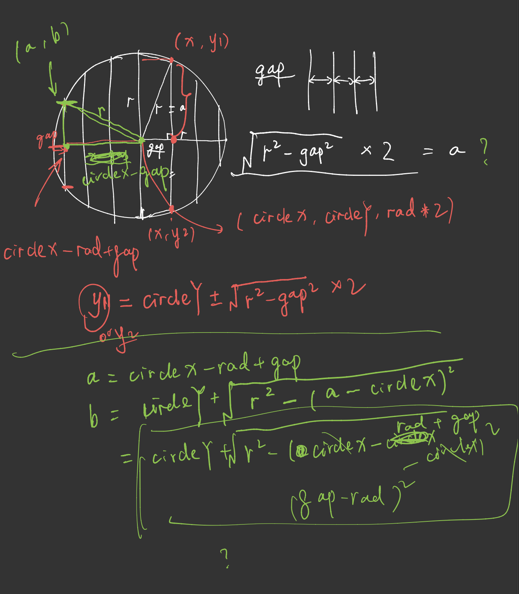
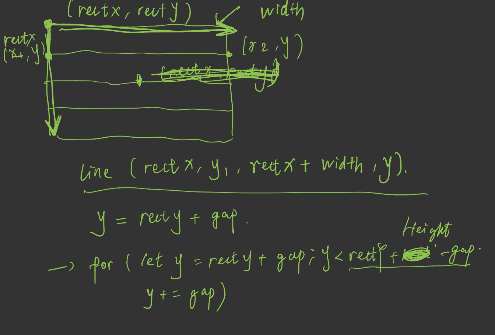

# HW04A/B
## HW04B - Randomness based on Sol LeWitt's Instruction

Explore randomness based on Sol LeWitt's Instruction. The entire process is pretty fun, because it forced me to review my high-shcool math knowlege.

"328" : {
    "title" : "Wall Drawing #328 (1980)",
    "description" : "On a black wall, a white circle within which are white vertical parallel lines, and a white parallelogram within which are white horizontal parallel lines. The vertical lines within the circle do not enter the parallelogram, and the horizontal lines within the parallelogram do not enter the circle."
  },

  Function Calculation Process:  
  
  